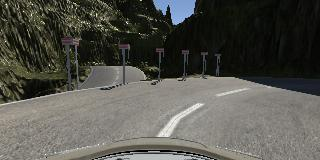

# Behavioral Cloning

## Writeup Template

### You can use this file as a template for your writeup if you want to submit it as a markdown file, but feel free to use some other method and submit a pdf if you prefer.

---

**Behavioral Cloning Project**

The goals / steps of this project are the following:
* Use the simulator to collect data of good driving behavior
* Build, a convolution neural network in Keras that predicts steering angles from images
* Train and validate the model with a training and validation set
* Test that the model successfully drives around track one without leaving the road
* Summarize the results with a written report


[//]: # (Image References)

[image1]: ./examples/placeholder.png "Model Visualization"
[image2]: ./examples/placeholder.png "Grayscaling"
[image3]: ./examples/placeholder_small.png "Recovery Image"
[image4]: ./examples/placeholder_small.png "Recovery Image"
[image5]: ./examples/placeholder_small.png "Recovery Image"
[image6]: ./examples/placeholder_small.png "Normal Image"
[image7]: ./examples/placeholder_small.png "Flipped Image"

## Rubric Points
### Here I will consider the [rubric points](https://review.udacity.com/#!/rubrics/432/view) individually and describe how I addressed each point in my implementation.  

---
### Files Submitted & Code Quality

#### 1. Submission includes all required files and can be used to run the simulator in autonomous mode

My project includes the following files:
* model.py containing the script to create and train the model
* drive.py for driving the car in autonomous mode
* model.h5 containing a trained convolution neural network 
* writeup.md summarizing the results
* video.mp4 video recording of the autonomous driving on track #1
* video-track2.mp4 video recording of the automomous driving on track #2

#### 2. Submission includes functional code
Using the Udacity provided simulator and my drive.py file, the car can be driven autonomously around the track by executing 
```sh
python drive.py model.h5
```

#### 3. Submission code is usable and readable

The model.py file contains the code for training and saving the convolution neural network. The file shows the pipeline I used for training and validating the model, and it contains comments to explain how the code works.

### Model Architecture and Training Strategy

#### 1. An appropriate model architecture has been employed

I've used the model published by NVIDIA in their [paper](https://devblogs.nvidia.com/parallelforall/deep-learning-self-driving-cars/). 


The only additions I've done to the model are some preprocessing steps:
1. Cropping top 20px and bottom 20px. Originally I was cropping top 50px and bottom 20px as David explained in the project video. But for track #2, for sections of the road with steep slops, cropping top 50px seems to have cut off some significant portions of the road, so I reduced it to 20px.
2. Resize the input images to 64x64 from the original size of 160x320 to speed up the training. I've noticed ~10x speed gain on my laptop (from ~700 seconds to ~70 seconds per epoch). 64x64 seems to be close to the smallest size that works. I've tried smaller values like 54 and I think it resulted in shapes of some convolutional layer being too small and errored out.
3. Normalize the images to be zero mean (x = x/255.0 - 0.5)

#### 2. Attempts to reduce overfitting in the model

The NVIDIA model doesn't have dropout layers and I didn't add one either. It seems to work pretty well. My main approach to reduce overfitting is to supply more variety of data.

#### 3. Model parameter tuning

The model used an adam optimizer, so the learning rate was not tuned manually (model.py line 75).

#### 4. Appropriate training data

The provided test data on track #1, combined with the NVIDIA model, works pretty well out of the box. I was able to get the model to almost finish track #1.

One data augmentation step I did is to flip the images horizontally to double the amount of training and validation data. I've also tried to use the left/right camera images. But somehow the model consistantly performed worse so I chose to just gather more laps of data by driving it myself in training mode.

For details about how I created the training data, see the next section. 

### Model Architecture and Training Strategy

#### 1. Solution Design Approach

Using the provided test data plus a couple laps done by myself, I was able to get the model to almost finish track #1. It was hitting the curb on the right side right after the stone bridge. It also ran into the water on the right sharp turn after the stone bridge. After supplying additional driving data for that section, the car was able to finish the whole lap of track #1.

#### 2. Final Model Architecture

The final model architecture (model.py lines 61-71) consisted of a convolution neural network with the following layers and layer sizes:
- Normalization layer
- 3 5x5 convolution layers with 2x2 stride and RELU activation
- 2 3x3 convolution layers with 1x1 stride and RELU activation
- 3 fully connected layers, output size 10. (NVIDIA model stops here)
- 1 fully connected layer, output size 1. We only have one output which is the steering angle, so I've added one more FC layer to match our output size.

Here is a visualization of the architecture (note: visualizing the architecture is optional according to the project rubric)


#### 3. Creation of the Training Set & Training Process

To capture good driving behavior, I first recorded two laps on track one using center lane driving. Here is an example image of center lane driving:


Then I repeated this process on track two in order to get more data points.

While fine tuning the model, I've recorded extra data around the section where the car was having problem steering through (the left turn right after the stone paved bridge). I'm a bit undertain whether this is good practice or bad practice as I'm essentially teaching the car to drive this particular section of road. Is this considered overfitting my model?
But then I also think maybe this section of road (with cubic posts and stacked tires at the curbeside) is under represented so the model didn't have enought data to learn how to handle it so adding more data for the section should be legit.

Steering the car in training mode wasn't easy. Also the "cruise" mode will speed up the car to 30 mph which is a bit too fast to steer through the turns. One trick I found was to constantly tapping the throttle key (w) and steer with the mouse. Tapping instead of press and hold the `w` key has the effect of "maintaining" the desired speed.

To augment the data set, I also flipped images. As track #1 is very left turn biased, flipping the image horizontally will compensate it by having the right turn biased driving data.

After the collection process, I had ~16k number of data points, which then doubles to ~32k with the image flipping. I then preprocessed this data by cropping, resizing and normalizatoin mentioned in earlier section above.

Model trained with data from track #1 doesn't work well on track #2 as the road condition is drastically different. The turns are sharper, there are shadows and shades from the mountains and trees, and more significantly, the road has center dashed while lines which track #1 doesn't have. So I did 4 laps on track 2 for additional training data. I also drove one lap at the lowest graphics quality (fastest) so there's no shadow on the road. I was hoping this would give the model a clearer "view" of the road. All other laps were recorded at the highest quality (fantastic). I used the lowest screen resolution though (640x480) so that the graphics card on my computer can handle it.

I finally randomly shuffled the data set and put 20% of the data into a validation set. 

I used this training data for training the model. The validation set helped determine if the model was over or under fitting. The ideal number of epochs was 5 as evidenced by validation loss stopped improving after epoch 5. I used an adam optimizer so that manually training the learning rate wasn't necessary.

Based on my observation, once trained with the lap data from track 2. Shadows or center dashed lines didn't cause too much trouble for the car to drive itself. What the car struggled the most was at sections where there are multiple roads that seem like valid continuation of the section of road the car was driving on. Here's one example:




As the car can't see 3D with spatial data, the road on the far left does seem like a valid extention to the road. So the model would steer the car to the left until it found out that was a bad idea, but it was too late for it to turn back due to the sharp right turn and it hit the mountain. What I did was to collect some more data for sections of road where there are the posts with the red stripes at the top, hoping it could learn that it can't drive through the posts. And it seems to worked as the car was able to finish track #2 afterwards.

With track 1 and 2 combined, I have ~42k number of data points, which doubles to ~84k with images flipped. Here's the output of one training run:

``````
Epoch 1/5
67966/67966 [==============================] - 192s - loss: 0.0491 - val_loss: 0.0394
Epoch 2/5
67966/67966 [==============================] - 193s - loss: 0.0402 - val_loss: 0.0369
Epoch 3/5
67966/67966 [==============================] - 195s - loss: 0.0365 - val_loss: 0.0357
Epoch 4/5
67966/67966 [==============================] - 192s - loss: 0.0334 - val_loss: 0.0364
Epoch 5/5
67966/67966 [==============================] - 191s - loss: 0.0306 - val_loss: 0.0363
``````

#### 4 Autonoumous driving videos

[Track1](video.mp4)

[Track2](video-track2.mp4)

[](https://www.youtube.com/watch?v=rwpxSraJwIs "CarND Project3 - Behavioral Cloning")
